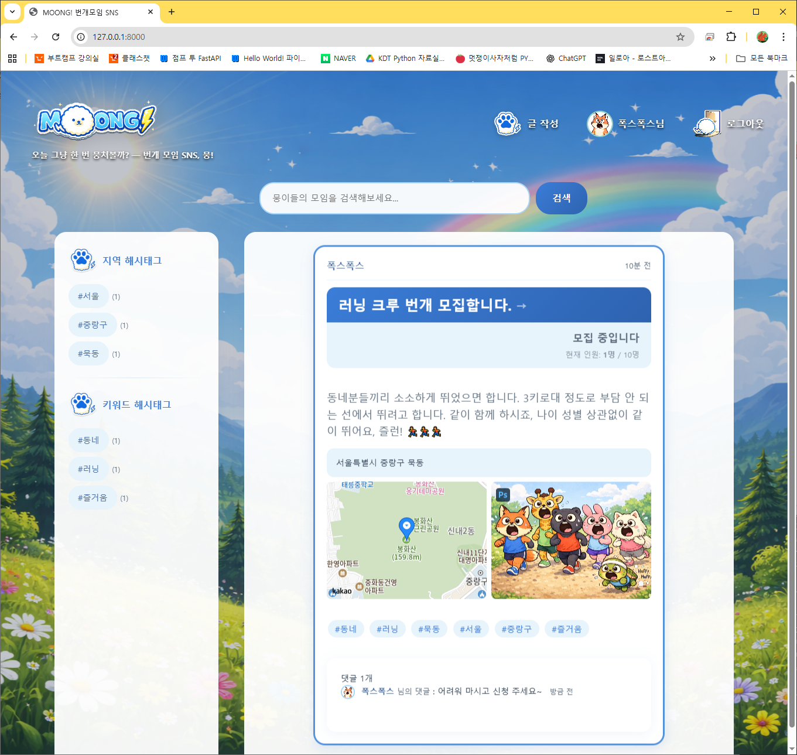
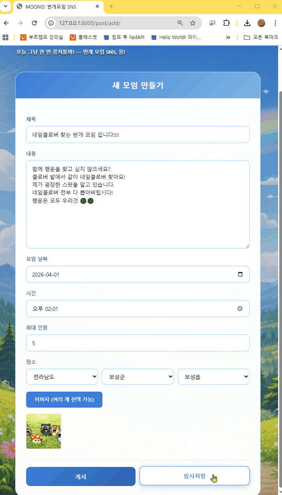
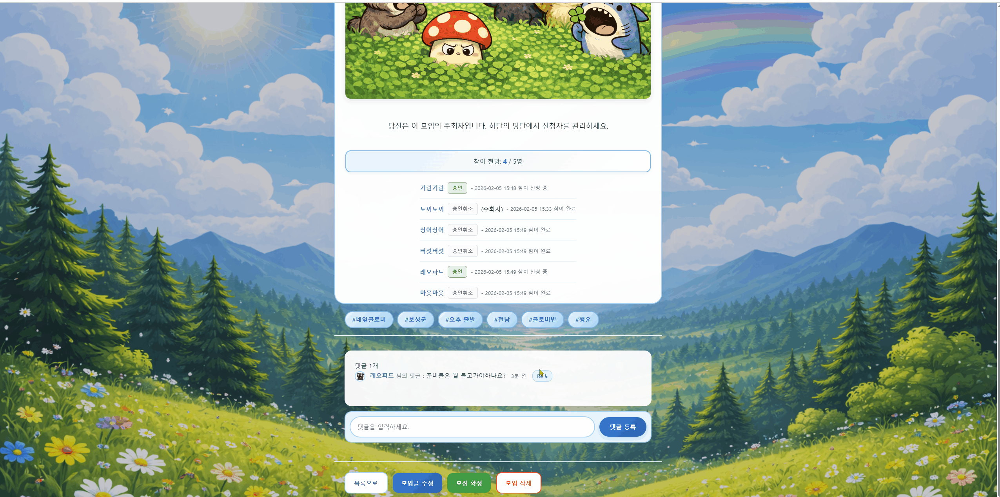
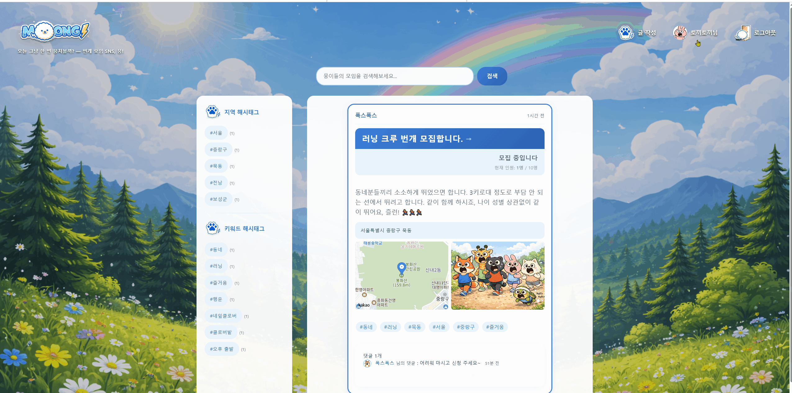
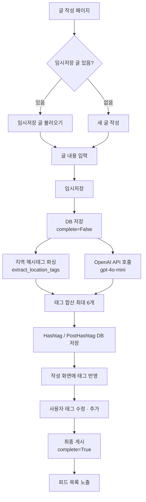

# MOONG! 번개모임 SNS
- 사용자가 즉시 모임을 생성하고 참여할 수 있는 '벙개 만남 중심 플랫폼'
- 단순한 인스타그램 클론 코딩에서 벗어난, SNS 플랫폼 프로젝트 수행.

[프로젝트 발표자료](https://docs.google.com/presentation/d/13RiIDvLdFT1VZj0Q3EYMLUbsCBPHW3Pq-bJ6WHqiBQ8/edit?usp=sharing)

---

## 📌 프로젝트 개요

* **개발 기간**: 2026.01.19 - 2026.02.03
* **구성**: 5인 팀 프로젝트

| 이름 | 역할 |
|------|--------|
| [나솔림](https://github.com/solrimna) | '벙개' 모임 모집글 작성 기능 |
| [이영진](https://github.com/ilove0628yj-w) | '벙개' 모임 참여 관리 |
| [서호근](https://github.com/azure5finger-cmyk) | 회원 관리 기능 / 피드 하단 댓글 기능 |
| [유민지](https://github.com/kittyjoa) | 마이페이지 조회/수정 및 활동이력 생성 |
| [박지영](https://github.com/battlegroundcallofduty) | AI 해시태그 생성 및 검색 조회 기능 |

* [요구사항 명세서](https://docs.google.com/spreadsheets/d/12-bzeP10GFYD7vwEOQrfJbKsLZVSEEEZ/edit?usp=sharing&ouid=116721417601261265482&rtpof=true&sd=true)

---

## 🛠 기술 스택

**Backend**


**Frontend**


**API / 외부 서비스**


**DevTools**


---

## 🔸 주요 기능

| 기능 | 설명 |
|------|------|
| 회원 관리 | 회원가입, 로그인/로그아웃, 프로필 수정 |
| 피드 목록 | 메인 피드 목록 및 실시간 만료 필터링 (당일 모임 시간 경과 시 자동 숨김) |
| 모임 모집글 작성 | 임시저장 → AI 해시태그 자동 생성 → 게시 단계별 플로우, 이미지 첨부 |
| 해시태그 검색 | 해시태그 클릭 시 해당 태그 피드 목록 페이지 이동, 글 내용 키워드 검색 |
| 모임 참여 관리 | 참여 신청/취소, 모임장 승인/거절, 정원 초과 시 대기 순번 자동 배정 |
| 댓글 | 댓글 작성/삭제, 모임장 댓글 공지 표시 |
| 마이페이지 | 생성/참여/종료 모임 이력, 받은 또뭉(좋아요) 수 조회 |
| 지도 연동 | Kakao Map API 기반 모임 장소 위치 표시 |
| 스케줄러 | APScheduler로 매일 00:05 만료 게시글 자동 상태 처리 |

---

## 스크린샷 및 데모 실행 화면

### 메인화면


### 모임생성


### 모임마감


### 댓글


### 마이페이지-또뭉(좋아요)


---

## ▪️ 프로젝트 구조

```
moong/
├── config/                  # Django 설정
│   ├── settings.py
│   └── urls.py
├── moong/                   # 핵심 앱 (모임 게시글)
│   ├── models.py            # Post, Hashtag, PostHashtag, Participation, Comment, Image, Ddomoong
│   ├── views.py             # 피드, 해시태그, AI 태그 생성, 검색
│   ├── urls.py
│   ├── scheduler.py         # APScheduler — 만료 게시글 자동 처리 (매일 00:05)
│   └── management/commands/expire_posts.py  # 스케줄러가 호출하는 만료 처리 커맨드
├── users/                   # 회원 앱
│   ├── models.py            # Custom User (AbstractUser 기반)
│   └── views.py             # 회원가입, 로그인, 마이페이지
├── locations/               # 지역 데이터 앱
│   ├── models.py            # Location (시/군/구/읍면동)
│   └── management/commands/import_locations.py
├── templates/
│   ├── moong/               # 피드, 글작성, 상세, 해시태그 등
│   └── users/               # 회원가입, 로그인, 마이페이지
├── static/                  # CSS, JS, 이미지
└── manage.py
```

### AI 해시태그 생성 플로우



> 단, 임시저장 없이 바로 최종 게시하거나 태그를 모두 해제한 경우, 태그를 자동으로 재생성한 후 글이 게시됩니다.

---

## 💡 내 담당 기능 상세

> AI 해시태그 생성 · 해시태그 검색 · 피드 목록

### 1. AI 해시태그 자동 생성

글 임시저장 시 OpenAI API를 호출해 게시글 내용 기반 해시태그를 자동 생성합니다.  
지역 태그(파싱)와 키워드 태그(AI)를 합산해 최대 6개로 제한하고, `Hashtag` / `PostHashtag` 테이블에 저장합니다.

```python
# views.py — ai_tags()
def ai_tags(content, location):
    loc_tags = extract_location_tags(location)  # 지역 태그 먼저 추출
    needed_count = 6 - len(loc_tags)            # 키워드 태그 개수 결정

    response = openai.chat.completions.create(
        model="gpt-4o-mini",
        messages=[
            {"role": "system", "content": "해시태그 생성기"},
            {"role": "user", "content": prompt}
        ],
        temperature=0.3,
    )
    result = response.choices[0].message.content.strip()
    keyword_tags = [k.strip().replace('#', '') for k in result.split(',')]

    total_tags = [t for t in (loc_tags + keyword_tags) if t and t != '|']
    return total_tags[:6]
```

> 실제 코드에는 입력값 가드 조건(`if not content and not location`)과 API 호출 실패에 대비한 `try-except` 에러 처리가 포함되어 있습니다.

### 2. 지역 해시태그 파싱

모임 장소의 주소 문자열을 파싱해 시·구·동 단위 지역 태그를 자동 생성합니다.  
광역시/도 → 약칭 변환 매핑(예: `서울특별시` → `서울`)을 딕셔너리로 직접 구현했습니다.

```python
# views.py — extract_location_tags()
a_short = short_names.get(a, a[:2])   # ex) 서울특별시 → 서울
loc_tags.append(a_short)
loc_tags.extend(details[:2])          # 구·동 최대 2개 추가
```

### 3. 메인페이지 설계 & 피드 목록

프로젝트 초기 메인페이지 레이아웃과 네비게이션 구조를 설계해 UI 기반을 마련했습니다.  
로고, 피드 카드, 해시태그 사이드 영역 등 초기 마크업 작업을 담당했습니다.  
메인 피드 목록(`main.html`)과 해시태그별 피드(`tag_feeds.html`) 페이지를 구현했으며, 글 내용 키워드 검색 기능도 함께 담당했습니다.

### 4. 해시태그 피드 목록 페이지 (`tag_feeds`)

특정 해시태그 클릭 시 해당 태그가 연결된 게시글만 필터링해 전용 페이지에 노출합니다.

```python
# views.py — tag_feeds()
def tag_feeds(request, tag_name):
    posts = Post.objects.filter(
        hashtags__name=tag_name,
        complete=True,
    ).prefetch_related('images', 'hashtags').order_by('-create_time')

    return render(request, 'moong/tag_feeds.html', {
        'tag_name': tag_name,
        'posts': posts,
    })
```

> 현재 코드에는 다른 팀원분이 모임 시간 기준 실시간 필터링(`.exclude()`)을 추가한 상태입니다.

---

## 🐛 트러블슈팅

### 임시저장 후 해시태그 미노출

- **현상**: 글 작성 중 임시저장 클릭 시 해시태그 영역이 화면에 표시되지 않음
- **원인**: 임시저장 시 게시글 데이터만 저장되고 해시태그는 DB에 저장되지 않아, 복원 시 태그 데이터가 없는 상태였음
- **해결**: 임시저장 시 게시글 데이터와 함께 해시태그도 DB에 저장하도록 처리

### 특정 지역 태그 중복 생성

- **현상**: `세종특별자치시 소담동`처럼 시군구명과 읍면동명이 동일한 행정구역의 경우, 원하는 태그(`세종`, `소담동`) 외에 `세종특별자치시`가 추가로 생성됨
- **원인**: 지역 태그 파싱 시 세종특별자치시와 같이 시/군/구 단위가 없는 행정구역 특수 케이스가 미처리된 상태였음
- **해결**: AI에 의존하지 않고 파싱 로직을 직접 수정하여, 읍/면/동이 시군구명과 일치하는 경우 중복을 제거하도록 처리


### 일반 키워드 해시태그의 지역 태그 오분류

- **현상**: `#운동` 등 `동`으로 끝나는 일반 키워드 해시태그가 지역 태그로 잘못 분류됨
- **원인**: 해시태그 분류 시 문자열 끝이 `동`으로 끝나는지 여부로 지역 태그를 판별하던 방식이 일반 단어와 충돌
- **해결**: Location 모델에서 실제 지역명 전체를 set으로 추출하여, 해시태그 이름이 정확히 일치할 때만 지역 태그로 분류하도록 변경 (`get_location_keywords()` + `categorize_hashtags()` 분리)

---
## ▪️ 로컬 실행 방법

회원가입 화면의 '활동 지역' 목록은 초기 데이터 적재 후 정상 노출됩니다.

### 1) 패키지 설치 or uv sync 수행(uv 사용 시)
- 1안 : 패키지 설치 `pip install -r requirements.txt`
- 2안 : `uv sync` (pyproject.toml 이용)

#### 1-1) 주요 설치 라이브러리
1. `django`
2. `openai` : 게시글 작성 후 AI 해시태그 생성 시 사용
3. `python-dotenv` : API key 별도 관리를 위해 추가 (.env 파일은 .gitignore에 포함)
4. `apscheduler` : Django 스케줄러 사용을 위함
    - 매일 00:05 만료된 모임 게시글을 `scheduler.py` → `expire_posts.py` 처리를 통해 완료 혹은 취소 처리
5. `pillow` : 이미지 표기 시 사용

#### 1-2) API KEY 입력하기 : .env 파일 생성 후 API key 입력
- 클론 받은 경로에 `.env` 파일을 생성합니다 (moong dir 바로 아래)
- 파일 내용 설정:
```
OPENAI_API_KEY="자신의 api key 입력"
KAKAO_APP_KEY="자신의 카카오 map api key 입력"
```

##### KAKAO_APP_KEY 생성하기
1. https://developers.kakao.com/console/app 접속
2. `+ 앱생성` 이후 생성한 앱 클릭
3. 왼쪽 메뉴 앱 > 플랫폼 키 > JavaScript 키 > Default JS Key > JavaScript SDK 도메인 설정
    - `http://127.0.0.1:8000` 추가
    - ⚠️ 카카오는 `localhost`와 `127.0.0.1`을 구별하므로 주의
4. 왼쪽 메뉴 제품 설정 > 카카오맵 > 사용 설정 > `off` → `on`

### 2) 마이그레이션
```bash
python manage.py migrate
```

### 3) 지역 데이터 적재 (생략 가능)
```bash
python manage.py import_locations
```
runserver 시 자동으로 실행되어 생략 가능 (처리 내용: `apps.py`)
이미 저장되어 있는 경우 skip되어 중복 저장되지 않음.

### 4) 관리자 계정 생성
```bash
python manage.py createsuperuser
```

### 5) 실행
```bash
python manage.py runserver
```

---

## 🔹 회고 및 개선 방향

### 기술적 개선 포인트
- **AI 태그 품질 향상**: 현재 단순 키워드 추출 방식에서 프롬프트 엔지니어링 고도화 검토
- **검색 고도화**: 현재 키워드 검색에서 해시태그 + 위치 + 날짜 복합 필터링으로 확장
- **코드 리팩토링**: views.py 비대화 문제 해소를 위한 서비스 레이어 분리, 클래스 기반 뷰(CBV) 전환 검토
- **모바일 대응**: 모임 SNS 특성상 모바일 사용 비율이 높을 것으로 예상되므로, 반응형 레이아웃 적용 및 PWA 전환 검토
- **지역 데이터 관리 개선**: 현재 로컬 CSV 파일 기반 적재 방식에서 행정안전부 공공데이터(data.go.kr)에서 제공하는 무료 행정구역 API 연동으로 전환하여 행정구역 변경 시 자동 반영 검토

### 서비스 방향성
- 번개모임 특화 플랫폼이 아직 부족한 시장에서, 위치·시간 기반 필터 고도화와 알림 기능 추가 시 실서비스 가능성 있음
- 상업화 시 유료 멤버십 또는 모임 주선 수수료 수익 구조 검토 가능

### 배포 계획
| 구분 | 내용 |
|------|------|
| 무료 배포 | Railway |
| 유료 배포 | AWS EC2 + Docker |
| 배포 시 필수 사항 | `.env` 환경변수 분리, `DEBUG=False`, static 파일 처리, SQLite → PostgreSQL 전환 |
